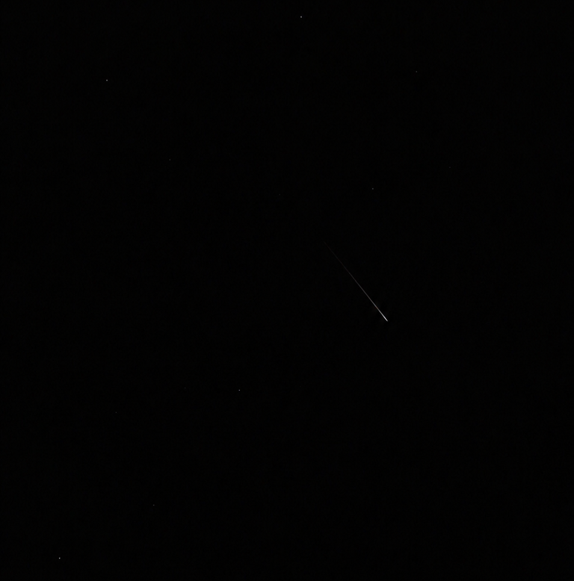
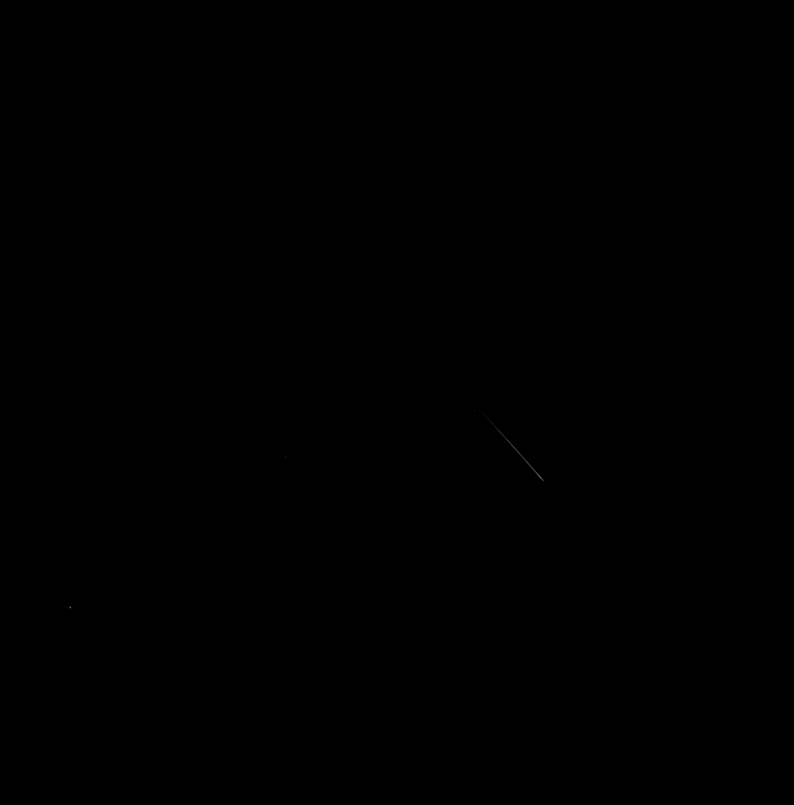

# Perseids

* **ID:** NS-P005
* **Date:** 13.08.26

## How the Phenomenon Occurs

The **Perseids** are a meteor shower associated with the comet **109P/Swift–Tuttle**.

As the comet travels around the Sun, it leaves behind dust particles and small fragments of material along its orbital path. Each year, Earth passes through this stream of particles.

When a particle enters Earth's upper atmosphere at very high speed, it collides with air molecules. The air surrounding the particle becomes heated and ionized, while the particle itself vaporizes.

We observe the light produced by this process as a **meteor** — a brief streak of light across the sky.

The Perseids appear to originate from one region of the sky, known as the **radiant**, which is located in the constellation of Perseus. This is where the meteor shower gets its name.

Although they appear among the stars, meteors actually occur relatively close to Earth on a cosmic scale. Their visible glow is typically produced at an altitude of **several tens of kilometers**, within Earth's upper atmosphere.

© NESTIMS
